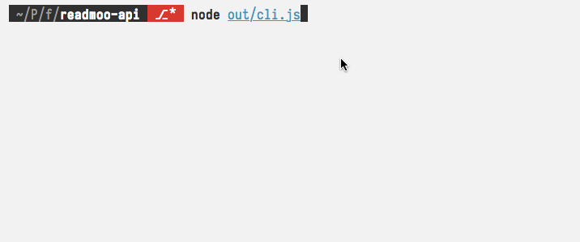

# Readmoo API Client

僅供技術研究，不負責本工具造成的任何侵權問題。自己的書自己買。

## Installation & Usage

```bash
npm i Yukaii/readmoo-api#v1.0.0 -g
readmoo-dl
```

Fill your login email & password, and then:



## Related Projects

不顧北京反對，一起拖下水

- [readmoo-dl](https://github.com/msglight4874/readmoo-dl) 讀墨 Epub 下載, written in Ruby by [@msglight4874][1]
- [books-dl](https://github.com/msglight4874/books-dl) 博客來 Epub 下載, written in Ruby by [@msglight4874][1]

## LICENSE

WTFPL

[1]: https://github.com/msglight4874
